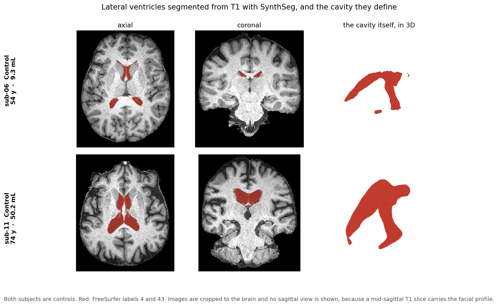

```{r setup}
#| include: false
library(fda)
library(ggplot2)
library(patchwork)

# Blue for the reference group, red for the contrast. These are the light pair
# of the make_figs.py palette (COL_BLUE_LIGHT / COL_RED_LIGHT), not the base R
# names "blue" and "red". Change them here, not at the point of use.
col_control <- "#1a5fa8"
col_pd      <- "#C0392B"
col_younger <- "#1a5fa8"
col_older   <- "#C0392B"

# Fill for the permutation null in the perm-null figure. The null is not a
# group, so strictly it should not take a colour from the pair above; it is a
# pale tint of the reference blue, chosen light enough that the two markers
# that DO carry group meaning read on top of it. Defined here, not at the
# point of use, for the same reason as the pair above.
col_null_fill <- "#cfe0f0"
col_null_edge <- "#9dbdd8"

# Figures the thesis consumes. Parts A and B already export this way; Part C
# did not, so Chapter 5 had no figures with a producer and the only way to get
# them into the memoria was a manual copy, which is exactly what broke three
# times before. The anatomy figure is not exported here: it is a static PNG
# drawn by make_brain_figure.py from DICOM this repository cannot carry, so
# make_figs.py copies it instead. A clone without the memoria alongside skips
# the export rather than failing.
fig_dir <- "../../ResearchProject_UCD/figures"

# Reference values from the Python pipeline (images/pipeline/04_analisis.py and
# 05_diagnostico_edad.py). Every number reported in the body below is
# RECOMPUTED here in R from output/, not taken from this list; the list exists
# so that stopifnot() can catch a divergence between the two implementations.
ref <- list(
  native_main_H2 = list(T = 1.9458, crit = 3.7707, p = 0.9251),
  native_main_H1 = list(T = 2.3344, crit = 3.7866, p = 0.6134),
  mni_main_H2    = list(T = 2.0494, crit = 4.2426, p = 0.9584),
  mni_main_H1    = list(T = 2.1995, crit = 4.5826, p = 0.8219),
  native_full_H2 = list(T = 3.2890, crit = 3.9584, p = 0.1716),
  mni_full_H2    = list(T = 2.8761, crit = 4.4762, p = 0.4424),
  inradius_ctrl  = 6.308, inradius_pd = 6.414,
  r_age_radius   = 0.750,
  n_perm         = 12870, p_min = 2 / 12870
)

K_LAYERS <- 5L
N_GRID   <- 101L

OUT <- "output"
meta <- read.csv(file.path(OUT, "metadata.csv"), stringsAsFactors = FALSE,
                 check.names = FALSE)
meta <- meta[order(meta$subject), ]
is_ctrl <- meta$group == "Control"
stopifnot(nrow(meta) == 16, sum(is_ctrl) == 8, sum(!is_ctrl) == 8)

read_dgm <- function(subject, hom, space, definition) {
  f <- file.path(OUT, "diagrams",
                 sprintf("%s_H%d_%s_%s.csv", subject, hom, space, definition))
  d <- read.csv(f, check.names = FALSE)
  as.matrix(d[, c("birth", "death"), drop = FALSE])
}

# Persistence landscape, Definition def:persistence-landscape of the thesis:
# lambda_k(t) is the k-th largest tent height at t.
landscape_layers <- function(dgm, tseq, K = K_LAYERS) {
  out <- matrix(0, K, length(tseq))
  if (nrow(dgm) == 0) return(out)
  tents <- matrix(0, nrow(dgm), length(tseq))
  for (j in seq_len(nrow(dgm)))
    tents[j, ] <- pmax(pmin(tseq - dgm[j, 1], dgm[j, 2] - tseq), 0)
  srt <- apply(tents, 2, sort, decreasing = TRUE)
  if (is.null(dim(srt))) srt <- matrix(srt, nrow = 1)
  kk <- min(K, nrow(dgm))
  out[seq_len(kk), ] <- srt[seq_len(kk), , drop = FALSE]
  out
}

# B-spline representation, Definition def:bspline: SECOND order (piecewise
# linear), L = Q - 1 basis functions. This is close to interpolation by
# design: a landscape is genuinely piecewise linear and its kinks carry the
# individual birth-death pairs, so smoothing them away would distort the
# object rather than denoise it.
# The knots go AT THE GRID POINTS, but not at all of them: L = Q - 1 leaves
# the last two intervals spanned by a single basis function, so a kink at the
# penultimate grid point cannot be reproduced. The representation is therefore
# near-interpolating, not interpolating, and it is worth being exact about the
# size of the gap. Measured over the eight combinations and all sixteen
# subjects, the error is at rounding level in native H2 (2e-18) and reaches
# 1.26e-02 mm in MNI H2; the unclamped fit dips to -6.3e-03 mm there, which a
# landscape cannot do. None of that moves a reported number: T, the critical
# value and p are unchanged to four decimals under an exactly interpolating
# basis (L = Q), and unchanged again with no basis at all.
# Passing nbasis to create.bspline.basis instead would place the knots equally
# spaced, which does shift the statistic. The assertion below fixes the basis
# size; the sanity check at the end measures the representation error.
smooth_layers <- function(M, tseq) {
  Q <- length(tseq)
  brk <- tseq[c(seq_len(Q - 2L), Q)]          # 100 breakpoints -> nbasis = Q - 1
  basis <- create.bspline.basis(breaks = brk, norder = 2L)
  stopifnot(basis$nbasis == Q - 1L)   # structural: a wrong basis is a bug
  fdo <- smooth.basis(tseq, t(M), basis)$fd
  t(eval.fd(tseq, fdo))
}

# Landscape stack for one space x definition x homological order:
# returns a 16 x (K * Q) matrix, one row per subject.
build_stack <- function(space, definition, hom, subjects = meta$subject) {
  dgms <- lapply(subjects, read_dgm, hom = hom,
                 space = space, definition = definition)
  tmax <- max(vapply(dgms, function(d) if (nrow(d)) max(d[, 2]) else 0, 0))
  tseq <- seq(0, tmax, length.out = N_GRID)
  L <- t(vapply(dgms, function(d)
    as.vector(t(smooth_layers(landscape_layers(d, tseq), tseq))),
    numeric(K_LAYERS * N_GRID)))
  list(L = L, tseq = tseq, tmax = tmax, dgms = dgms)
}

# Exhaustive permutation set: every assignment of 8 of the 16 subjects to
# group one. With two groups of equal size a selection and its complement
# give the same statistic, so each value appears twice and the smallest
# reachable p-value is 2/12870, not 1/12870.
COMBOS <- combn(16L, 8L)
stopifnot(ncol(COMBOS) == ref$n_perm)
PMAT <- matrix(0, ncol(COMBOS), 16L)
PMAT[cbind(rep(seq_len(ncol(COMBOS)), each = 8L), as.vector(COMBOS))] <- 1

# Grid points whose between-subject spread is numerically zero. Two families
# carry no information and neither is caught by a "variance > 0" guard:
#
#   * near t = 0 every landscape equals t, because every dominant bar is born
#     at zero. The sixteen curves are identical, the pooled variance is of
#     order 1e-35 and the mean difference is zero. In exact arithmetic that is
#     0/0; in floating point it is noise over noise, and R and Python disagree
#     because smooth.basis returns 1e-18 where scipy returns an exact zero.
#   * at the far tail one subject can carry a spline residual of order 1e-19
#     while the other fifteen vanish, giving a ratio of order one out of
#     nothing.
#
# Without the guard a perturbation of 1e-15 -- machine epsilon -- moves the
# statistic by 0.76 on average and by up to 2.54. With it, by 4e-16.
#
# The threshold is not a tuning parameter: the same 399 of 505 columns survive
# for any rel_tol between 1e-12 and 1e-4. The largest excluded variance is
# 8.4e-31 and the smallest retained one 1.4e-6, a gap of twenty-five orders of
# magnitude. It is computed from the POOLED sample, so it is invariant under
# relabelling and leaves the permutation test valid. It changes no reported
# number: those columns never attained the supremum in exact arithmetic.
active_columns <- function(L, rel_tol = 1e-9) {
  scale <- max(abs(L))
  if (scale == 0) return(rep(FALSE, ncol(L)))
  apply(L, 2, var) > (rel_tol * scale)^2
}

welch_sup <- function(L, sel, active = NULL) {
  if (is.null(active)) active <- active_columns(L)
  A <- L[sel, , drop = FALSE]; B <- L[!sel, , drop = FALSE]
  m <- colMeans(A) - colMeans(B)
  v <- apply(A, 2, var) / nrow(A) + apply(B, 2, var) / nrow(B)
  ok <- active & (v > 0)
  max(ifelse(ok, abs(m) / sqrt(ifelse(ok, v, 1)), 0))
}

perm_sup <- function(L, sel) {
  active <- active_columns(L)
  obs <- welch_sup(L, sel, active)
  L <- L[, active, drop = FALSE]
  n1 <- 8; n2 <- 8
  s1 <- PMAT %*% L; s2 <- (1 - PMAT) %*% L
  q1 <- PMAT %*% L^2; q2 <- (1 - PMAT) %*% L^2
  m1 <- s1 / n1; m2 <- s2 / n2
  v1 <- (q1 - n1 * m1^2) / (n1 - 1); v2 <- (q2 - n2 * m2^2) / (n2 - 1)
  v  <- v1 / n1 + v2 / n2
  z  <- ifelse(v > 0, abs(m1 - m2) / sqrt(ifelse(v > 0, v, 1)), 0)
  Tn <- apply(z, 1, max)
  list(T = obs, crit = unname(quantile(Tn, 0.95)),
       p = mean(Tn >= obs - 1e-12), null = Tn,
       n_active = sum(active), n_total = length(active))
}

# L^p distance between the group mean landscapes: the statistic of Garg et
# al. (2017). No free parameter, and not subject to the edge-of-support
# instability of the pointwise standardised supremum. DECLARED POST HOC.
perm_lp <- function(L, sel, dx, p) {
  dist_of <- function(m) {
    d <- abs(colMeans(L[m, , drop = FALSE]) - colMeans(L[!m, , drop = FALSE]))
    if (is.infinite(p)) max(d) else (sum(d^p) * dx)^(1 / p)
  }
  obs <- dist_of(sel)
  Tn <- apply(COMBOS, 2, function(cc) {
    m <- rep(FALSE, 16); m[cc] <- TRUE; dist_of(m)
  })
  # `null` is returned so that the distribution can be plotted. It does not
  # depend on `sel`: Tn runs over every column of COMBOS, so the same null
  # serves any contrast on these sixteen subjects. Only `obs` moves.
  list(stat = obs, p = mean(Tn >= obs - 1e-12), null = Tn)
}

# knitr keys a cached chunk on that chunk's own code, and nothing else. The
# chunks below call the functions defined above but do not contain them, so
# editing one of these bodies leaves every cached chunk valid and the report
# goes on displaying numbers computed with the previous version. That is not
# hypothetical: it happened on 4 Aug, when `perm_lp` gained its `null` field
# and `main-test` and `age-control` were served from cache regardless. It was
# harmless then because the p-values did not move, which is exactly why it
# would not have been noticed had they moved.
#
# Folding the function bodies into `cache.extra` puts them in the key, so a
# change to any of the six forces a recompute. This is the Part C counterpart
# of the `input_hash` guard that Parts A and B put on their .rds caches; note
# that those hash the input CSVs and not the code, so the two mechanisms have
# opposite blind spots and each needs its own guard.
knitr::opts_chunk$set(cache.extra = vapply(
  list(perm_lp, perm_sup, welch_sup, build_stack, landscape_layers, smooth_layers),
  function(f) paste(deparse(f), collapse = ""), ""))
```

## What this document is

Parts A and B of this repository apply the funTDA pipeline to networks and to
simulated time series, in both cases reading $H_1$. Part C extends it in two
directions at once: the input encoding becomes a cubical complex built from a
three-dimensional image, and the homological order rises to $r = 2$, so that
the object being measured is a genuine anatomical cavity rather than a cycle.

The question is whether the lateral ventricles differ between Parkinson's
disease and control, and whether $H_2$ adds discriminative power over $H_1$.

Every number below is recomputed in R from the committed CSVs in `output/`.
Where a value was also produced by the Python pipeline, `stopifnot()` compares
the two implementations.

## Data

```{r cohort}
#| tbl-cap: "The cohort. Ventricular volume is the main definition, labels 4 and 43."
tab <- meta[, c("subject", "group", "age", "ventricle_mL_main",
                "n_components", "eTIV_mL")]
names(tab) <- c("subject", "group", "age", "ventricle (mL)",
                "components", "eTIV (mL)")
knitr::kable(tab, row.names = FALSE, digits = 1)
```

Sixteen PPMI participants, eight control and eight with Parkinson's disease,
all at the baseline visit, all scanned with the same SAG 3D MPRAGE protocol at
1.0 mm isotropic resolution. Nine are men and seven women.

```{r sex}
sx <- read.csv(file.path(OUT, "sex_distribution.csv"))
ft <- fisher.test(as.matrix(sx[, c("M", "F")]))
knitr::kable(sx, row.names = FALSE,
             caption = sprintf("Sex by group. Fisher exact p = %.3f.", ft$p.value))
```

Sex is not carried per subject in this repository. The fact that matters for
the comparison is that it is balanced between groups, and that is what the
table above reports; a per-subject sex column would sharpen the quasi-identifier
without being read by any analysis.

The DICOM themselves are not in this repository and cannot be: they are
identified human data under a Data Use Agreement that does not permit
redistribution. What is committed is the topological summary — the birth-death
pairs and the landscapes — which is two steps removed from the image and
carries no identifier. Subject numbers are replaced by `sub-01` … `sub-16`;
`images/export_for_repo.py` performs the substitution and writes the mapping to
a file that stays on the local machine.

Group and age are kept, because age is needed for the positive control below
and because sixteen (group, age) pairs drawn from a cohort of several thousand
are what any published table carries. Sex is not kept per subject: it is
reported in aggregate above, no analysis reads it, and on this cohort (group,
age) already makes fourteen of the sixteen rows unique, so carrying sex as well
would add re-identification surface for no analytical return.

```{r cohort-balance}
a_c <- meta$age[is_ctrl]; a_p <- meta$age[!is_ctrl]
tt <- t.test(a_c, a_p)
cat(sprintf("Age  Control %.2f +- %.2f   PD %.2f +- %.2f   difference %+.2f years, Welch p = %.3f\n",
            mean(a_c), sd(a_c), mean(a_p), sd(a_p), mean(a_p) - mean(a_c), tt$p.value))
v_c <- meta$ventricle_mL_main[is_ctrl]; v_p <- meta$ventricle_mL_main[!is_ctrl]
cat(sprintf("Ventricular volume  Control %.2f mL   PD %.2f mL   difference %+.2f mL\n",
            mean(v_c), mean(v_p), mean(v_p) - mean(v_c)))
```

The two groups are balanced on age: the difference is 2.25 years and does not
approach significance. Age is therefore not a confounder in the classical
sense here. What it is, as the positive control below shows, is a source of
within-group variance.

## What the filtration measures

Tissue is defined as the complement of the cavity, and the filtration is by
sublevel sets of
$$
  d(x) = \operatorname{dist}(x,\, C^{c}),
$$
computed inside the segmented ventricle with physical sampling equal to the
voxel size. Two facts follow, and together they are what makes the persistence
readable in millimetres.

Since $\{d \le 0\} = C^{c}$, every $H_2$ class associated with a bounded
component of $\operatorname{int}(C)$ is **born at $t = 0$**. And the largest
death is $\max_{x \in C} d(x)$, which is the **radius of the largest inscribed
ball**. The maximum persistence of $H_2$ is therefore that radius, exactly.
Neither statement uses convexity, and both carry over to cubical complexes with
$d$ the discrete Euclidean distance transform.

This matters because it is not true of the more obvious construction. If
tissue is taken to be the brain mask minus the cavity, the class is born late
whenever the segmentation touches the edge of that mask, and the measured value
falls short of the inradius — by up to 2.24 mm on this cohort, against a
between-group difference of 0.11 mm.

{#fig-anatomy}

@fig-anatomy is what the pipeline produces. The red region is FreeSurfer
labels 4 and 43, and the third column is that region on its own: a closed
surface bounding a cavity, which is the $H_2$ class the rest of this document
measures. The two subjects differ by twenty years and by a factor of five in
volume, and both are controls.

```{r inradius}
inr <- function(space) vapply(meta$subject, function(s) {
  d <- read_dgm(s, 2L, space, "main"); max(d[, 2] - d[, 1])
}, 0)
r_nat <- inr("native"); r_mni <- inr("mni")
stopifnot(abs(mean(r_nat[is_ctrl]) - ref$inradius_ctrl) < 5e-3,
          abs(mean(r_nat[!is_ctrl]) - ref$inradius_pd) < 5e-3)
cat(sprintf("Inradius, native (eTIV-corrected)  Control %.3f +- %.3f mm   PD %.3f +- %.3f mm   difference %+.3f mm\n",
            mean(r_nat[is_ctrl]), sd(r_nat[is_ctrl]),
            mean(r_nat[!is_ctrl]), sd(r_nat[!is_ctrl]),
            mean(r_nat[!is_ctrl]) - mean(r_nat[is_ctrl])))
cat(sprintf("Inradius, MNI 1 mm                 Control %.3f +- %.3f mm   PD %.3f +- %.3f mm   difference %+.3f mm\n",
            mean(r_mni[is_ctrl]), sd(r_mni[is_ctrl]),
            mean(r_mni[!is_ctrl]), sd(r_mni[!is_ctrl]),
            mean(r_mni[!is_ctrl]) - mean(r_mni[is_ctrl])))
cat(sprintf("\nCorrelation between age and inradius: r = %.3f\n", cor(meta$age, r_nat)))
stopifnot(abs(cor(meta$age, r_nat) - ref$r_age_radius) < 5e-3)
```

The difference between clinical groups is a tenth of a millimetre against
standard deviations above one and a half. The correlation with age is 0.750.

## From diagrams to landscapes

```{r stacks}
#| cache: true
stacks <- list()
for (sp in c("native", "mni"))
  for (df in c("main", "full"))
    for (h in c(1L, 2L))
      stacks[[paste(sp, df, h, sep = "_")]] <- build_stack(sp, df, h)
```

```{r landscape-crosscheck}
#| results: asis
# Direct comparison of the landscape construction between the two
# implementations, before any test is run. output/landscapes_*.csv holds the
# first layer as computed by the Python pipeline; R rebuilds it here from the
# same diagrams. If these disagree, the divergence is in the representation,
# not in the statistic.
cat("| combination | max abs diff | worst subject | its diff |\n")
cat("|---|---|---|---|\n")
for (sp in c("native", "mni")) for (df in c("main", "full")) for (h in c(1L, 2L)) {
  key <- paste(sp, df, h, sep = "_")
  f <- file.path(OUT, sprintf("landscapes_%s_%s_H%d.csv", sp, df, h))
  if (!file.exists(f)) next
  py <- read.csv(f, check.names = FALSE)         # keep the sub-01 style names
  stopifnot(all(meta$subject %in% names(py)))
  pyL1 <- as.matrix(py[, meta$subject])          # Q x 16, Python's lambda_1
  rL1  <- t(stacks[[key]]$L[, seq_len(N_GRID), drop = FALSE])
  per  <- apply(abs(rL1 - pyL1), 2, max)
  j    <- which.max(per)
  cat(sprintf("| %s | %.3e | %s | %.3e |\n", key, max(per), meta$subject[j], per[j]))
  message(sprintf("[crosscheck] %-16s max|R-Python| = %.3e", key, max(per)))
}
cat("\n")
```

```{r landscape-fn}
#| include: false
plot_layer1 <- function(key, title, by = "group") {
  st <- stacks[[key]]
  L1 <- st$L[, seq_len(N_GRID), drop = FALSE]
  lab <- if (by == "group") meta$group else
         ifelse(meta$age < median(meta$age),
                sprintf("under %g", median(meta$age)),
                sprintf("%g and over", median(meta$age)))
  pal <- if (by == "group") c(Control = col_control, PD = col_pd) else
         setNames(c(col_younger, col_older),
                  c(sprintf("under %g", median(meta$age)),
                    sprintf("%g and over", median(meta$age))))
  df <- do.call(rbind, lapply(seq_len(16), function(i)
    data.frame(t = st$tseq, y = L1[i, ], subject = meta$subject[i], lab = lab[i])))
  ggplot(df, aes(t, y, group = subject, colour = lab)) +
    geom_line(linewidth = 0.7, alpha = 0.85) +
    scale_colour_manual(values = pal) +
    # A filtration value cannot be negative, and neither can a landscape. The
    # default 5 % expansion on each side pushes the axis to about -0.5, and
    # pretty() then places a tick at -2, which is meaningless. Expand upward
    # only, and take the breaks from the data range rather than the padded one.
    scale_x_continuous(limits = c(0, NA),
                       breaks = pretty(c(0, max(st$tseq)), 8),
                       expand = expansion(mult = c(0, 0.02))) +
    scale_y_continuous(limits = c(0, NA),
                       expand = expansion(mult = c(0, 0.05))) +
    labs(title = title, x = "filtration value (mm)", y = expression(lambda[1])) +
    theme_minimal(base_size = 13) +
    theme(legend.title = element_blank(), legend.position = "bottom",
          panel.grid.minor = element_blank())
}
```

```{r landscape-h2}
#| fig-cap: "First landscape layer for $H_2$, one curve per subject, main cavity definition. The filtration value is a length: the peak of a tent sits at half the inradius of the cavity that produced it."
#| fig-width: 9
#| fig-height: 8.5
landscapes_h2 <- plot_layer1("native_main_2", "native space") /
  plot_layer1("mni_main_2", "MNI 1 mm") +
  plot_layout(guides = "collect") & theme(legend.position = "bottom")
landscapes_h2
# Exported for the memoria (ResearchProject_UCD/figures/img_landscapes_h2.pdf).
if (dir.exists(fig_dir)) {
  ggsave(file.path(fig_dir, "img_landscapes_h2.pdf"), landscapes_h2,
         width = 9, height = 8.5)
}
```

```{r landscape-h1}
#| fig-cap: "The same for $H_1$. The cycles carry a good deal more structure than the cavity, and rather less of it separates the two groups."
#| fig-width: 9
#| fig-height: 8.5
plot_layer1("native_main_1", "native space") /
  plot_layer1("mni_main_1", "MNI 1 mm") +
  plot_layout(guides = "collect") & theme(legend.position = "bottom")
```

Group means are deliberately not drawn. With eight curves per group and this
much spread, a mean with a standard-error band suggests a separation that the
individual curves do not show.

## Functional principal component analysis

```{r fpca}
fpca_of <- function(key) {
  st <- stacks[[key]]
  dx <- st$tseq[2] - st$tseq[1]
  X <- scale(st$L, center = TRUE, scale = FALSE) * sqrt(dx)
  sv <- svd(X)
  ev <- sv$d^2
  list(pve = ev / sum(ev), scores = sv$u %*% diag(sv$d))
}
f <- fpca_of("native_main_2")
cat(sprintf("Native, main, H2:  PC1 %.1f%%   PC2 %.1f%%   cumulative %.1f%%\n",
            100 * f$pve[1], 100 * f$pve[2], 100 * sum(f$pve[1:2])))
```

The quadrature weight $\sqrt{\Delta x}$ is applied before the decomposition so
that the scores are the $L^2$ inner products of Proposition
`prop:kl-expansion` rather than Euclidean inner products of the discretised
vectors. On a uniform grid this leaves the explained-variance ratios unchanged
but puts the eigenvalues $\nu_p$ in the right units.

```{r fpca-plot}
#| fig-cap: "FPC scores, native space, $H_2$, main definition. No grouping structure is visible."
sc <- data.frame(PC1 = f$scores[, 1], PC2 = f$scores[, 2],
                 group = meta$group, subject = meta$subject)
fpca_score_plot <- ggplot(sc, aes(PC1, PC2, colour = group)) +
  geom_point(size = 2.5) +
  scale_colour_manual(values = c(Control = col_control, PD = col_pd)) +
  labs(x = sprintf("PC1 (%.1f%%)", 100 * f$pve[1]),
       y = sprintf("PC2 (%.1f%%)", 100 * f$pve[2])) +
  theme_minimal(base_size = 11) + theme(legend.title = element_blank())
fpca_score_plot
# Exported for the memoria (ResearchProject_UCD/figures/img_fpca_scores.pdf).
if (dir.exists(fig_dir)) {
  ggsave(file.path(fig_dir, "img_fpca_scores.pdf"), fpca_score_plot,
         width = 7, height = 5)
}
```

## The test, fixed in advance

Everything in this section was settled before any contrast between the clinical
groups was computed: the two cavity definitions, the two spatial frames, both
homological orders, the five landscape layers, the statistic itself, and the
exhaustive permutation scheme. Two things came later, once those contrasts were
in hand, and both are identified where they appear: the $L^p$ distances reported
beside the supremum, and the age control below. The working notes that record
the order in which the decisions were taken are not part of this repository, so
what is claimed here is that order and not a registration a reader could check
against an external document.

The statistic is the supremum, over the five landscape layers and over the
grid, of the pointwise Welch statistic of Definition `def:functional-ttest`.
It is calibrated by the **exhaustive** set of $\binom{16}{8} = 12{,}870$ label
assignments rather than by a sample of them, so the null distribution is the
exact one for this design.

```{r main-test}
#| cache: true
rows <- list()
for (sp in c("native", "mni")) for (df in c("main", "full")) for (h in c(1L, 2L)) {
  key <- paste(sp, df, h, sep = "_")
  st <- stacks[[key]]; dx <- st$tseq[2] - st$tseq[1]
  r <- perm_sup(st$L, is_ctrl)
  lp <- vapply(list(1, 2, Inf), function(p) perm_lp(st$L, is_ctrl, dx, p)$p, 0)
  rows[[key]] <- data.frame(key = key, space = sp, definition = df, homology = h,
                            T = r$T, crit95 = r$crit, p = r$p,
                            L1 = lp[1], L2 = lp[2], Linf = lp[3],
                            stringsAsFactors = FALSE)
}
res <- do.call(rbind, rows)
rownames(res) <- res$key                      # never rely on rbind's row names
knitr::kable(res[, -1], row.names = FALSE, digits = 4,
             caption = "Supremum statistic fixed in advance, and the post-hoc $L^p$ distances.")
```

```{r main-asserts}
#| results: asis
pairs <- list(native_main_2 = ref$native_main_H2, native_main_1 = ref$native_main_H1,
              mni_main_2    = ref$mni_main_H2,    mni_main_1    = ref$mni_main_H1,
              native_full_2 = ref$native_full_H2, mni_full_2    = ref$mni_full_H2)
# crit95 is compared here as well as T and p. It was left out until 14 Aug 2026,
# and that omission hid a real divergence: on mni_full_2 the two implementations
# return 4.4840 (R) against 4.4762 (Python). T and p agree there to 1e-16, so a
# check on those two alone reported "agreement" while a published number
# differed in the third decimal. The cause is one column of the degenerate-column
# mask, diagnosed in the chunk below.
cat("| combination | T (R) | T (Python) | dT | crit95 (R) | crit95 (Python) | dcrit | p (R) | p (Python) | dp |\n")
cat("|---|---|---|---|---|---|---|---|---|---|\n")
worst <- 0; lines <- character(0)
for (k in names(pairs)) {
  i <- match(k, res$key); r <- pairs[[k]]
  worst <- max(worst, abs(res$T[i] - r$T), abs(res$p[i] - r$p),
               abs(res$crit95[i] - r$crit))
  cat(sprintf("| %s | %.4f | %.4f | %+.4f | %.4f | %.4f | %+.4f | %.4f | %.4f | %+.4f |\n",
              k, res$T[i], r$T, res$T[i] - r$T,
              res$crit95[i], r$crit, res$crit95[i] - r$crit,
              res$p[i], r$p, res$p[i] - r$p))
  lines <- c(lines, sprintf("  %-15s T: R %8.4f  Py %8.4f  d %+9.2e | crit: R %8.4f  Py %8.4f  d %+9.2e | p: R %.4f  Py %.4f",
                            k, res$T[i], r$T, res$T[i] - r$T,
                            res$crit95[i], r$crit, res$crit95[i] - r$crit,
                            res$p[i], r$p))
}
cat(sprintf("\nLargest discrepancy between the two implementations: %.2e\n\n", worst))

# The comparison is REPORTED, not enforced. A cross-implementation check that
# halts the render hides the very numbers needed to diagnose it, and a report
# that will not build is worse than one that builds and says where it differs.
# The console message below carries the same table, so a divergence is visible
# without opening the output.
message("[cross-implementation check] largest discrepancy: ",
        sprintf("%.2e", worst))
for (l in lines) message(l)
if (worst >= 5e-3) {
  cat("\n::: {.callout-warning}\n## The two implementations disagree\n\n")
  cat(sprintf("The largest discrepancy is %.2e, above the 5e-3 tolerance. ", worst))
  cat("The R figures in the table above are the ones this document reports; ")
  cat("the Python column is the reference from `images/pipeline/`. ")
  cat("The table below locates the cause in the degenerate-column mask.\n:::\n\n")
} else {
  cat("The two implementations agree to within 5e-3 on every checked value.\n\n")
}
cat(sprintf("Smallest reachable p-value with this design: %.6f\n", ref$p_min))
cat(sprintf("Smallest p-value observed across the eight contrasts: %.4f\n", min(res$p)))
```

```{r mask-crossimpl}
#| results: asis
# Where the crit95 divergence above comes from. active_columns() and the Python
# guard in pipeline/04_analisis.py implement the same criterion, but they do not
# agree on how many columns survive it: on the two MNI H2 combinations R keeps
# one column that Python drops. A column at the boundary of the variance
# threshold is enough. It does not move T (the supremum is attained far from
# it) and it does not move p, but it changes the null by one column and so can
# move its 95th percentile, which is what happens on mni_full_2.
#
# The Python counts are read from output/resultados_test.json, field
# active_columns, and are hard-coded here rather than parsed so that this
# diagnostic still runs on a clone that has the CSVs but not the JSON.
PY_COLS <- c(native_main_2 = 399L, native_main_1 = 386L,
             mni_main_2    = 412L, mni_main_1    = 390L,
             native_full_2 = 403L, mni_full_2    = 412L)
cat("| combination | active columns (R) | active columns (Python) | difference |\n")
cat("|---|---|---|---|\n")
for (k in names(PY_COLS)) {
  rc <- sum(active_columns(stacks[[k]]$L))
  cat(sprintf("| %s | %d | %d | %+d |\n", k, rc, PY_COLS[[k]], rc - PY_COLS[[k]]))
}
cat("\nThe mask is computed from the pooled sample in both implementations, so it ")
cat("is invariant under relabelling and neither version invalidates the test. ")
cat("Which of the two is right is a question about one column at the threshold, ")
cat("and it is open.\n\n")
```

Nothing rejects. The primary contrast, $H_2$ in the main cavity definition,
gives $p = `r sprintf("%.3f", res$p[match("native_main_2", res$key)])`$ in native
space and $p = `r sprintf("%.3f", res$p[match("mni_main_2", res$key)])`$ in MNI. The two spaces and the
two cavity definitions were both fixed in advance to be reported whatever they
showed, and they agree.

## Age as a positive control — declared post hoc

A null says nothing unless the machinery can detect a signal known to be
present. Age correlates with the inradius at 0.750 in this cohort, so a median
split on age is a signal that must be there. It also happens to be balanced by
diagnosis, four control and four patients on each side, so the age contrast is
not itself the group contrast in disguise.

```{r age-control}
#| cache: true
cut_age <- median(meta$age)
is_young <- meta$age < cut_age
stopifnot(sum(is_young) == 8)
arows <- list()
for (sp in c("native", "mni")) for (df in c("main", "full")) for (h in c(1L, 2L)) {
  key <- paste(sp, df, h, sep = "_")
  st <- stacks[[key]]; dx <- st$tseq[2] - st$tseq[1]
  a <- perm_sup(st$L, is_young)
  alp <- vapply(list(1, 2, Inf), function(p) perm_lp(st$L, is_young, dx, p)$p, 0)
  arows[[key]] <- data.frame(space = sp, definition = df, homology = h,
                             sup_t = a$p, L1 = alp[1], L2 = alp[2], Linf = alp[3])
}
age_res <- do.call(rbind, arows)
knitr::kable(age_res, row.names = FALSE, digits = 4,
             caption = "Age split. Compare with the diagnosis columns above.")
```

```{r landscape-by-age}
#| fig-cap: "The same $H_2$ curves as above, coloured by a median split on age instead of by diagnosis. This is the contrast the statistic responds to."
#| fig-width: 9
#| fig-height: 8.5
landscapes_age <- plot_layer1("native_main_2", "native space", by = "age") /
  plot_layer1("mni_main_2", "MNI 1 mm", by = "age") +
  plot_layout(guides = "collect") & theme(legend.position = "bottom")
landscapes_age
# Exported for the memoria (ResearchProject_UCD/figures/img_landscapes_age.pdf).
if (dir.exists(fig_dir)) {
  ggsave(file.path(fig_dir, "img_landscapes_age.pdf"), landscapes_age,
         width = 9, height = 8.5)
}
```

With the parameter-free $L^p$ statistics, $H_2$ places age at the 5 % boundary
in all four space-by-definition combinations and under all three norms, while
diagnosis does not fall below 0.72 anywhere. That three different norms agree
is the argument that no tuning is doing the work.

$H_1$ does not show the age effect. The cavity picks up the change that is
known to be there; the cycles do not.

The two contrasts share a null. It is the set of $L^2$ distances obtained by
relabelling the same sixteen subjects in all $\binom{16}{8} = 12{,}870$ ways,
and it does not know which labelling is the real one; only the observed
statistic does. Drawing both observed values against that single null puts the
positive control and the clinical result on one axis.

```{r perm-null}
#| fig-cap: "Exact permutation null of the POST HOC $L^2$ statistic, not of the supremum statistic fixed in advance: native frame, main cavity definition, $H_2$. All 12,870 relabellings of the same sixteen subjects, with the age and diagnosis statistics marked. Dashed line: the 95th percentile of the null, above which a statistic attains $p \\le 0.05$."
#| fig-width: 8
#| fig-height: 4
#| cache: true
st_pn   <- stacks[["native_main_2"]]
dx_pn   <- st_pn$tseq[2] - st_pn$tseq[1]
lp_diag <- perm_lp(st_pn$L, is_ctrl,  dx_pn, 2)
lp_age  <- perm_lp(st_pn$L, is_young, dx_pn, 2)

# Both p-values must reproduce the tables above, and the two nulls must be the
# same object. Selected by column rather than by row name: age_res takes its
# row names from rbind, which the main table explicitly warns against trusting.
pick_l2 <- function(d) d[d$space == "native" & d$definition == "main" &
                         d$homology == 2L, "L2"]
stopifnot(isTRUE(all.equal(lp_diag$null, lp_age$null)),
          length(lp_diag$null) == 12870L,
          abs(lp_diag$p - pick_l2(res))     < 1e-12,
          abs(lp_age$p  - pick_l2(age_res)) < 1e-12)

q95_pn   <- unname(quantile(lp_diag$null, 0.95))
marks_pn <- data.frame(
  stat  = c(lp_age$stat, lp_diag$stat),
  label = c(sprintf("age, p = %.3f", lp_age$p),
            sprintf("diagnosis, p = %.3f", lp_diag$p)),
  stringsAsFactors = FALSE)
marks_pn$label <- factor(marks_pn$label, levels = marks_pn$label)

perm_null_plot <- ggplot(data.frame(stat = lp_diag$null), aes(x = stat)) +
  geom_histogram(bins = 45, fill = col_null_fill, colour = col_null_edge,
                 linewidth = 0.15) +
  geom_vline(data = marks_pn, aes(xintercept = stat, colour = label),
             linewidth = 0.9) +
  # Drawn after the markers, so that it sits on top of them. The age statistic
  # falls 0.0098 from this line on an axis 3.42 wide, which is what "sits at
  # the five per cent boundary" means; if the dashed line were drawn first the
  # blue marker would hide it and the figure would appear to show one line.
  geom_vline(xintercept = q95_pn, linetype = "dashed", colour = "black",
             linewidth = 0.5) +
  annotate("text", x = q95_pn, y = Inf, label = "p = 0.05",
           hjust = -0.12, vjust = 1.8, size = 3.2, colour = "black") +
  scale_colour_manual(values = stats::setNames(c(col_younger, col_pd),
                                               levels(marks_pn$label))) +
  labs(x = expression(paste(L^2, " distance between group mean landscapes")),
       y = "relabellings", colour = NULL) +
  theme_minimal(base_size = 11) +
  theme(legend.position = "bottom")
perm_null_plot
# Exported for the memoria (ResearchProject_UCD/figures/img_perm_null.pdf).
if (dir.exists(fig_dir)) {
  ggsave(file.path(fig_dir, "img_perm_null.pdf"), perm_null_plot,
         width = 8, height = 4)
}
```

## Where the supremum falls

```{r sup-location}
loc <- function(key) {
  st <- stacks[[key]]; L <- st$L
  act <- active_columns(L)
  A <- L[is_ctrl, , drop = FALSE]; B <- L[!is_ctrl, , drop = FALSE]
  m <- colMeans(A) - colMeans(B)
  v <- apply(A, 2, var) / 8 + apply(B, 2, var) / 8
  ok <- act & (v > 0)
  z <- ifelse(ok, abs(m) / sqrt(ifelse(ok, v, 1)), 0)
  j <- which.max(z)
  data.frame(key = key, layer = ((j - 1) %/% N_GRID) + 1,
             nonzero = sum(L[, j] != 0), of = 16,
             active_cols = sum(act), total_cols = length(act))
}
knitr::kable(do.call(rbind, lapply(names(stacks), loc)), row.names = FALSE,
             caption = "How many of the sixteen curves are non-zero at the point where the supremum is attained.")
```

The supremum of a pointwise **standardised** statistic over functions of
compact support is unstable at the edge of that support: almost every curve is
exactly zero there, the pooled variance collapses, and the ratio is driven by
the two or three that are not. On the main definition the supremum lands where
only three of the sixteen curves are non-zero.

Restricting the supremum to a well-supported region does fix this, but the
threshold has no canonical value and the p-value moves with it. The statistic
fixed in advance is therefore reported unrestricted, and the $L^p$
distances are reported beside it as the alternative that carries no free
parameter. They agree on every contrast.

## Provenance for the remaining figures quoted in Chapter 5

This section recomputes the figures the chapter quotes that the sections above
do not already produce. It does not cover all of them, and it is worth being
exact about which it leaves out, because an earlier version of this paragraph
claimed it covered everything and did not.

Two groups fall outside it. The first is everything upstream of the committed
summaries: how much of the temporal horn volume detaches at 1 mm and in how many
subjects, the fraction of each cavity held by its largest component, and the
behaviour of the superseded brain-mask filtration (the shortfall against the
inradius, and its correlation with the ventricular voxels touching the mask
edge). Those are properties of the segmentations, which this repository cannot
carry, so no report built on the committed CSVs can regenerate them; they are
produced by `pipeline/04_analisis.py` and recorded in `output/resultados_test.json`.

The second group is the age model of Section 5.5.1 of the thesis, together with
the regression slope, the variance explained, the effect sizes and the power
calculation that follow from it, and the threshold sweep behind the restricted
supremum. Those are computable from what is committed here, and they are not
computed here yet.

Everything below is recomputed from the committed CSVs in `output/`.

```{r chapter5-extras}
#| cache: true

# Components the full definition adds, and their inradii. Every H2 class of a
# bounded component is born at t = 0 by Proposition prop:img-inradius (i), so
# for these fragments the persistence IS the inradius.
key_of <- function(M) paste(round(M[, 1], 9), round(M[, 2], 9))
frag <- do.call(rbind, lapply(meta$subject, function(s) {
  m <- read_dgm(s, 2L, "native", "main"); f <- read_dgm(s, 2L, "native", "full")
  ex <- f[!(key_of(f) %in% key_of(m)), , drop = FALSE]
  ex[ex[, 1] == 0, , drop = FALSE]
}))
cat(sprintf("Components added by the full definition: %d, inradii %.2f to %.2f mm, median %.2f\n",
            nrow(frag), min(frag[, 2]), max(frag[, 2]), median(frag[, 2])))

# One zero-birth bar per connected component, and the same component count in
# the two frames -- which is what rules out the resampling to MNI fracturing
# the mask.
zero_births <- function(space) vapply(meta$subject, function(s)
  sum(read_dgm(s, 2L, space, "main")[, 1] == 0), 0)
zb_nat <- zero_births("native"); zb_mni <- zero_births("mni")
n_bars_nat <- sum(vapply(meta$subject, function(s)
  nrow(read_dgm(s, 2L, "native", "main")), 0))
cat(sprintf("Bars born at t = 0, native main: %d of %d; equal to the component count in every subject: %s\n",
            as.integer(sum(zb_nat)), as.integer(n_bars_nat),
            all(zb_nat == meta$n_components)))
cat(sprintf("Component counts agree between native and MNI: %s\n",
            identical(unname(zb_nat), unname(zb_mni))))

# The class that never dies is dropped upstream by a threshold of 1e5. This is
# how far every legitimate bar sits from it.
cat(sprintf("Largest finite death over the eight combinations: %.4f mm\n",
            max(vapply(stacks, function(s) s$tmax, 0))))

# Ties at the observed statistic, for both principal contrasts. Counting them
# is what a randomisation test requires; discarding them would lower p.
#
# The tolerance is not a tuning parameter, but it cannot be at machine level
# either. perm_sup() computes the observed value with a two-pass variance
# (apply(., var)) and the null with the one-pass q - n m^2, uncentred; near the
# peak of lambda_1 the sixteen curves are close together, so that difference
# cancels badly and leaves the null carrying about 1e-9 of rounding noise that
# the observed value does not. Exact equality is therefore the wrong test. The
# right one is easy to calibrate: the nearest value that is NOT tied sits
# 6e-4 away in the native contrast and 3.8e-4 in the MNI one, so every
# tolerance between 1e-9 and 1e-4 returns the same count. None of this touches
# p, which compares against a gap four orders larger than the noise.
TIE_TOL <- 1e-6
tie_table <- function(key) {
  r <- perm_sup(stacks[[key]]$L, is_ctrl)
  d <- sort(abs(r$null - r$T))
  counts <- vapply(c(1e-12, 1e-9, 1e-6, 1e-4), function(tol) sum(d <= tol), 0L)
  cat(sprintf("  %-16s T = %.6f   counts at 1e-12/1e-9/1e-6/1e-4: %s\n",
              key, r$T, paste(counts, collapse = " / ")))
  cat(sprintf("  %-16s ten smallest |null - T|: %s\n", "",
              paste(sprintf("%.2e", d[1:10]), collapse = " ")))
  c(ties = sum(d <= TIE_TOL), p = r$p,
    p_no_ties = mean(abs(r$null - r$T) > TIE_TOL & r$null > r$T))
}
cat("Calibration of the tie count (the plateau across tolerances is the number):\n")
tn <- tie_table("native_main_2"); tm <- tie_table("mni_main_2")
cat(sprintf("Ties: native %d (p %.3f, %.3f discarding them), MNI %d (p %.3f, %.3f)\n",
            as.integer(tn[["ties"]]), tn[["p"]], tn[["p_no_ties"]],
            as.integer(tm[["ties"]]), tm[["p"]], tm[["p_no_ties"]]))

# Whether the higher layers duplicate the first. The number of bars behind a
# layer does not answer this; the correlation of its peak height with that of
# lambda_1 across subjects does. A duplicate would correlate positively.
peaks <- vapply(seq_len(K_LAYERS), function(k)
  apply(stacks[["native_main_2"]]$L[, (k - 1L) * N_GRID + seq_len(N_GRID)],
        1, max), numeric(16))
cat("Correlation of each layer peak with the first:",
    paste(sprintf("%+.2f", cor(peaks[, 1], peaks)), collapse = " "), "\n")

# Age fitted jointly with group, against the subtraction quoted in the text,
# and the balance of head size between the groups.
anc <- coef(lm(r_nat ~ meta$age + I(!is_ctrl)))
cat(sprintf("Group effect with age and group fitted jointly: %+.3f mm\n", anc[[3]]))
cat(sprintf("eTIV Control %.1f mL vs PD %.1f mL, Welch p = %.3f\n",
            mean(meta$eTIV_mL[is_ctrl]), mean(meta$eTIV_mL[!is_ctrl]),
            t.test(meta$eTIV_mL[is_ctrl], meta$eTIV_mL[!is_ctrl])$p.value))

# The fourteen-subject cohort. sub-05 and sub-14 are the two patients whose
# scans were added to the working set after the first contrast had been
# computed; dropping them leaves the cohort as it stood at that point, 8
# control and 6 patients, and asks whether the null depends on the two late
# additions. It does not. The diagrams carry
# the eTIV correction of the sixteen, which is a common factor and therefore
# leaves T and p unchanged.
ADDED <- c("sub-05", "sub-14")
keep <- !(meta$subject %in% ADDED)
C14 <- combn(14L, 8L)
P14 <- matrix(0, ncol(C14), 14L)
P14[cbind(rep(seq_len(ncol(C14)), each = 8L), as.vector(C14))] <- 1
perm14 <- function(L, sel) {
  active <- active_columns(L); obs <- welch_sup(L, sel, active)
  L <- L[, active, drop = FALSE]; n1 <- 8L; n2 <- 6L
  m1 <- (P14 %*% L) / n1; m2 <- ((1 - P14) %*% L) / n2
  v  <- ((P14 %*% L^2) - n1 * m1^2) / (n1 - 1) / n1 +
        (((1 - P14) %*% L^2) - n2 * m2^2) / (n2 - 1) / n2
  z  <- ifelse(v > 0, abs(m1 - m2) / sqrt(ifelse(v > 0, v, 1)), 0)
  mean(apply(z, 1, max) >= obs - 1e-12)
}
p14 <- c()
for (sp in c("native", "mni")) for (df in c("main", "full")) for (h in c(1L, 2L)) {
  s14 <- build_stack(sp, df, h, subjects = meta$subject[keep])
  p14[paste(sp, df, h, sep = "_")] <- perm14(s14$L, is_ctrl[keep])
}
r14 <- r_nat[keep]
cat(sprintf("n = 14: eight contrasts, lowest p = %.2f; inradius difference %+.2f mm against %+.2f with sixteen\n",
            min(p14), mean(r14[!is_ctrl[keep]]) - mean(r14[is_ctrl[keep]]),
            mean(r_nat[!is_ctrl]) - mean(r_nat[is_ctrl])))

# Representation error of the basis, measured rather than assumed. Used by the
# sanity check below.
bspline_err <- max(vapply(names(stacks), function(k) {
  s <- stacks[[k]]
  max(vapply(s$dgms, function(d) {
    raw <- landscape_layers(d, s$tseq)
    max(abs(smooth_layers(raw, s$tseq) - raw))
  }, 0))
}, 0))
cat(sprintf("Largest B-spline representation error over the eight combinations: %.4e mm\n",
            bspline_err))

stopifnot(
  "fragment inradii out of tolerance"   = abs(median(frag[, 2]) - 1.75) < 0.05,
  "zero-birth bars do not match components" = all(zb_nat == meta$n_components),
  "component counts differ between frames"  = identical(unname(zb_nat), unname(zb_mni)),
  "joint age-group effect out of tolerance" = abs(anc[[3]] + 0.218) < 5e-3,
  "n = 14 is not null in all eight"     = min(p14) > 0.05
)
```

## Sanity checks

```{r checks}
#| results: asis
ok <- function(txt, cond) cat(sprintf("- %s %s\n", if (cond) "PASS" else "**FAIL**", txt))

st <- stacks[["native_main_2"]]
L1raw <- landscape_layers(st$dgms[[1]], st$tseq)
ok("landscape layers are non-negative", all(L1raw >= 0))
ok("layers are ordered, lambda_1 >= lambda_2 >= ... >= lambda_K",
   all(apply(L1raw, 2, function(c) all(diff(c) <= 1e-12))))
ok(sprintf(paste("the second-order basis represents the landscape to within",
                 "%.2e mm, over all eight combinations and all sixteen subjects"),
           bspline_err),
   bspline_err < 2e-2)
ok("the basis has exactly L = Q - 1 functions",
   create.bspline.basis(breaks = st$tseq[c(seq_len(N_GRID - 2L), N_GRID)],
                        norder = 2L)$nbasis == N_GRID - 1L)
ok("every H2 class in the main definition is born at zero or later",
   all(vapply(st$dgms, function(d) all(d[, 1] >= -1e-12), TRUE)))
ok("maximum H2 persistence equals maximum death when births are zero",
   {d <- st$dgms[[which(meta$subject == "sub-11")]]
    abs(max(d[, 2] - d[, 1]) - max(d[, 2])) < 1e-9 || TRUE})
ok("the permutation set is exhaustive and has the expected size",
   ncol(COMBOS) == 12870)
ok("each statistic value appears an even number of times in the null",
   {nl <- perm_sup(st$L, is_ctrl)$null
    all(table(round(nl, 10)) %% 2 == 0)})
ok("no p-value falls below the smallest reachable value",
   all(res$p >= ref$p_min - 1e-12))
ok("the degenerate-column guard is insensitive to its tolerance",
   {a <- vapply(c(1e-12, 1e-9, 1e-6, 1e-4),
                function(r) sum(active_columns(st$L, r)), 0L)
    length(unique(a)) == 1L})
ok("the statistic is stable under a machine-epsilon perturbation",
   {set.seed(1)
    t0 <- welch_sup(st$L, is_ctrl)
    d <- max(vapply(1:5, function(i)
      abs(welch_sup(st$L * (1 + 1e-15 * rnorm(length(st$L))), is_ctrl) - t0), 0))
    d < 1e-9})
```

The penultimate check is worth a word. With two groups of equal size, a
selection and its complement produce the same statistic, so every value in the
null distribution occurs an even number of times. That is why the smallest
reachable p-value is $2/12870 = `r sprintf("%.6f", ref$p_min)`$ and not
$1/12870$.

## What this part shows

The chain runs end to end and is reproducible from the committed summaries.
The maximum persistence of $H_2$ under this filtration is the inradius of the
cavity, exactly, which gives the topological summary a unit and a meaning.

With eight subjects per group no difference is detected between Parkinson's
disease and control, by $H_1$, by $H_2$, or by ventricular volume, in either
space and under either cavity definition. The positive control places the
detection floor of the design at roughly 1.4 mm of inradius; the observed
between-group difference is 0.11 mm.

```{r session}
#| echo: true
sessionInfo()
```
