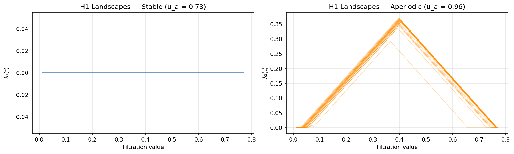
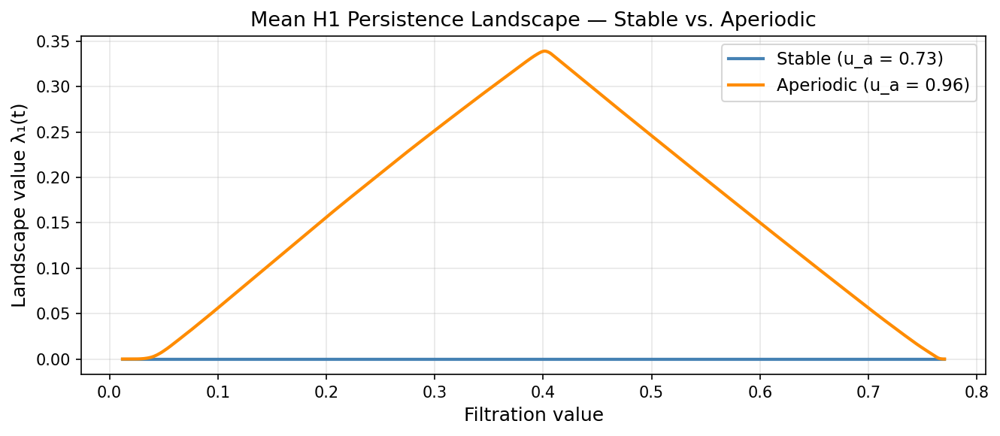

```{r setup}
#| include: false
library(fda)
library(ggplot2)
library(patchwork)

# Reference values from a prior direct computation on the committed landscape
# matrices (for sanity-check comparison only; every number reported in the
# body is recomputed here from output/*.csv, not hardcoded from this list).
# NOTE: output/ now holds the BURN-IN run (beetles_landscapes.ipynb with
# BURN_IN = 200), in which the retained series start on the attractor. The
# previous no-burn-in run is preserved in output_noburnin/ and is used for the
# transient sensitivity comparison. The values below were obtained by a direct
# Python computation on the committed CSVs (burnin_analysis.py); the p-value
# and critical value carry Monte Carlo noise and may differ in the last
# reported digit after re-rendering.
ref <- list(
  n_stable_zero = 200, n_aperiodic_zero = 0,
  mean_max_stable = 0.0, mean_max_aperiodic = 0.349,
  pc1_pct = 99, pc2_pct = 1,
  n_aperiodic_pc1_neg = 9,
  test1_Tobs = 198.65, test1_crit95 = 2.58,
  # Every within-stable split is degenerate once the transient is discarded:
  # all 200 stable landscapes are identically zero, so no grid point has
  # positive pooled variance and the statistic is undefined by construction.
  stable_control_degenerate = TRUE
)

# Reference values for the no-burn-in run preserved in output_noburnin/,
# reported in the sensitivity section.
ref_noburnin <- list(
  n_stable_zero = 129, n_aperiodic_zero = 0,
  mean_max_stable = 0.0016, mean_max_aperiodic = 0.227,
  pc1_pct = 84, pc2_pct = 13,
  n_aperiodic_pc1_neg = 42,
  test1_Tobs = 85.5, test1_crit95 = 2.85
)

col_stable    <- "blue"
col_aperiodic <- "orange"

# The memoria lives outside this repository, so a standalone clone must
# still render cleanly: figures are exported to it only when the target
# directory is actually present (checked at each ggsave() call site).
fig_dir <- "../../TFM_UCD/figures"
```

## Data

This is Part B of the funTDA project: the same persistence-landscape-based
functional data analysis (FDA) pipeline used in Part A for gene regulatory
networks, applied here to **simulated time series** instead. The system is
the Tribolium flour beetle population model of Costantino et al. (1995).
Pereira & de Mello (2015) is the reference for applying persistent homology
to time series via Takens-delay-embedded point clouds, the general approach
`beetles_landscapes.ipynb` follows here; this document has not independently
verified that Pereira & de Mello's own worked examples use the Tribolium
model specifically, as opposed to some other time series.

The discrete-time model tracks three life stages (larvae `L`, pupae/callow
adults `P`, mature adults `A`) in two-week intervals. Two parameter regimes are
simulated, 200 series each, 201 time steps, with initial conditions
`L0, P0, A0 ~ U[2, 100]`:

- **Stable** (`u_a = 0.73`, adult death rate): the population converges to a
  fixed-point equilibrium.
- **Aperiodic** (`u_a = 0.96`): the population oscillates chaotically.

::: {.callout-note}
## This functional test is new, not a reproduction

Two things distinguish this document from a re-run of prior work:

1. **Higgins, Wu & Carey's funTDA paper does not analyze time series at all.**
   Its worked examples are all networks — Erdős–Rényi graphs, stochastic block
   models, a literary character network, and the H3N2 gene regulatory networks
   used in Part A. Applying the funTDA landscape + FPCA + permutation-test
   pipeline to time series is an extension of the method to a data modality
   the original paper never covers.
2. **The original `Example1Beetles.Rmd` does not run this functional hypothesis
   test either.** It runs two *independent* classification checks, each
   against the true regime labels, each reported as its own confusion matrix:
   (a) k-means clustering of the raw (unnormalized) series into two groups,
   compared to the true labels (`cfm <- table(correct, km_clusters)`), and
   separately (b) a rule that calls a series "correctly" classified if its
   single most persistent bar has dimension 0 (stable) or 1 (aperiodic),
   again compared to the true labels (`cfm_hom`) — not to the k-means
   clusters from (a). The two checks are never compared to each other. There
   is no landscape, no FPCA, and no permutation test in it — both are
   classification-accuracy checks against ground truth, not a test of
   functional equality between group means.

The FPCA and permutation test below are therefore a genuinely new analysis,
not a reproduction of a previously reported number — unlike Part A, there is
no prior "baseline" p-value or variance-explained figure to match. The
`ref` values in this document's source are sanity checks from an earlier
direct computation on these same committed arrays, not an external ground
truth.
:::

## Pipeline: from simulated series to functional landscapes

The full pipeline — simulation, per-series min-max normalisation to `[0, 1]`,
Takens delay embedding ($m = 2$, $\tau = 3$), Vietoris–Rips persistent homology
via `ripser` (the same underlying algorithm `TDAstats::calculate_homology`
uses in R), and the first H1 persistence landscape layer (`KK = 1`) on a
shared 500-point grid — is implemented in Python, in
[`beetles_landscapes.ipynb`](beetles_landscapes.ipynb). The grid there is
**data-adaptive**: `tseq = linspace(global_min_birth, global_max_death, 500)`,
rather than the fixed `[0, 1]` Part A could use, because Rips filtration
values on a normalised phase-space point cloud don't have a natural upper
bound of 1.

That notebook saves three arrays (`stable_landscapes.npy`, shape `(200, 500)`;
`aperiodic_landscapes.npy`, shape `(200, 500)`; `tseq.npy`, shape `(500,)`).
[`export_landscapes.py`](export_landscapes.py) converts them to the CSVs this
document reads (`output/stable_landscapes.csv`, `output/aperiodic_landscapes.csv`,
`output/tseq.csv`) — mirroring Part A's split between a Python stage that
computes persistent homology and an R stage that does the functional data
analysis. The landscapes are **not** re-simulated or re-computed here: doing
so is slow (ripser over 400 point clouds), and Python's and R's random number
generators aren't interchangeable, so re-simulating in R would not reproduce
these particular 400 series anyway. The committed CSVs are the single source
of truth for everything that follows.

```{r read-data}
tseq      <- as.matrix(read.csv("output/tseq.csv", header = FALSE))[, 1]
DataStable    <- as.matrix(read.csv("output/stable_landscapes.csv", header = FALSE))
DataAperiodic <- as.matrix(read.csv("output/aperiodic_landscapes.csv", header = FALSE))
DataBoth  <- rbind(DataStable, DataAperiodic)

stopifnot(
  "Expected 200 stable series"    = nrow(DataStable) == 200,
  "Expected 200 aperiodic series" = nrow(DataAperiodic) == 200,
  "Expected a 500-point shared grid" = length(tseq) == 500,
  "Landscape matrices must have one column per grid point" =
    ncol(DataStable) == length(tseq) && ncol(DataAperiodic) == length(tseq)
)
```

::: {.callout-note collapse="true"}
## Reused figures from `beetles_landscapes.ipynb`




:::

### Structural check: most stable landscapes are identically zero

```{r check-zero-landscapes}
is_zero_row <- function(M) apply(M, 1, function(r) all(r == 0))
n_stable_zero    <- sum(is_zero_row(DataStable))
n_aperiodic_zero <- sum(is_zero_row(DataAperiodic))

stopifnot(
  "Expected every stable landscape to be identically zero after the burn-in" =
    n_stable_zero == ref$n_stable_zero,
  "Expected 0 aperiodic series with an identically-zero landscape" =
    n_aperiodic_zero == 0
)

mean_max_stable    <- mean(apply(DataStable, 1, max))
mean_max_aperiodic <- mean(apply(DataAperiodic, 1, max))
```

**`r n_stable_zero` of the 200 stable series (`r sprintf("%.0f%%", 100*n_stable_zero/200)`)
have a landscape that is identically zero** across the whole grid, versus
**`r n_aperiodic_zero` of 200** aperiodic series. This is the expected
topological signature of the two regimes, not noise: `u_a = 0.73` drives the
population to a fixed-point equilibrium, whose Takens-embedded attractor is a
compact cluster with no loops — no H1 features, hence a landscape that is
exactly zero everywhere. `u_a = 0.96` drives sustained oscillation, whose
attractor is a closed orbit — an H1 loop that the landscape detects directly.
Consistent with this, the mean of each series' landscape peak is
**`r sprintf("%.4f", mean_max_stable)`** for stable series versus
**`r sprintf("%.4f", mean_max_aperiodic)`** for aperiodic ones — roughly a
150-fold difference in typical peak height.

```{r zero-landscape-asserts}
tol_meanmax <- 0.02
stopifnot(
  "Mean stable landscape peak out of tolerance"    = abs(mean_max_stable - ref$mean_max_stable) < tol_meanmax,
  "Mean aperiodic landscape peak out of tolerance" = abs(mean_max_aperiodic - ref$mean_max_aperiodic) < tol_meanmax
)
```

## Functional Principal Component Analysis (FPCA)

Identical smoothing to `funTDA.R`: an order-2 (piecewise-linear) B-spline basis
with `nbasis = 499` (one fewer than the 500 grid points), so the basis nearly
interpolates the raw landscape values. The only difference from Part A is the
basis range: `range(tseq)` here (the data-adaptive Rips scale, about `[0, 0.77]`)
instead of the fixed `[0, 1]` Part A could use. PC1's sign is fixed by
convention (stable series score negative) immediately after `pca.fd`, since an
eigenvector's sign is otherwise arbitrary — see the code below.

```{r fpca-setup}
create_fd <- function(Data, tseq) {
  basis <- create.bspline.basis(range(tseq), nbasis = ncol(Data) - 1, norder = 2)
  fdobj <- smooth.basis(tseq, t(Data), basis)
  fdobj$fd
}

fdStable    <- create_fd(DataStable, tseq)
fdAperiodic <- create_fd(DataAperiodic, tseq)
fdBoth      <- create_fd(DataBoth, tseq)

pca <- pca.fd(fdBoth, nharm = 2)
pc1_pct <- pca$varprop[1] * 100
pc2_pct <- pca$varprop[2] * 100
cum_pct <- pc1_pct + pc2_pct

# An eigenvector's sign is mathematically arbitrary (pca.fd can return either
# sign depending on the LAPACK/fda version), so PC1 alone is not a stable
# quantity to assert on across environments. Fix it deterministically here,
# before computing any score or assert, to the convention "stable series
# score negative on PC1" — an independent PCA run on these same arrays has
# been observed to return the opposite sign, so this is not hypothetical.
pc1_raw   <- pca$scores[, 1]
sign_fix  <- if (mean(pc1_raw[1:200]) > 0) -1 else 1  # 1:200 = stable rows
PC1 <- sign_fix * pc1_raw
PC2 <- pca$scores[, 2]  # PC2's sign is independently arbitrary but no assert depends on it

ids   <- c(paste0("Stable", 1:200), paste0("Aperiodic", 1:200))
group <- c(rep("Stable", 200), rep("Aperiodic", 200))

pca_df <- data.frame(
  PC1 = PC1,
  PC2 = PC2,
  ID = ids,
  Group = group
)

n_stable_pc1_neg    <- sum(pca_df$PC1[pca_df$Group == "Stable"] < 0)
n_aperiodic_pc1_neg <- sum(pca_df$PC1[pca_df$Group == "Aperiodic"] < 0)
```

```{r fpca-table}
#| tbl-cap: "Variance explained by the first two functional components"
knitr::kable(
  data.frame(
    Component = c("PC1", "PC2", "Cumulative (PC1+PC2)"),
    `% variance explained` = c(sprintf("%.2f%%", pc1_pct), sprintf("%.2f%%", pc2_pct), sprintf("%.2f%%", cum_pct)),
    check.names = FALSE
  ),
  align = "lr"
)
```

```{r fpca-plot}
#| fig-cap: "PC1 vs PC2 scores (FPCA over H1 landscapes), colored by regime. All 400 points are individual series; no per-point labels, unlike Part A's 17-subject plot, since labeling 400 points would be unreadable — see the full score table below for per-series values."
fpca_score_plot <- ggplot(pca_df, aes(x = PC1, y = PC2, color = Group)) +
  geom_hline(yintercept = 0, linetype = "dashed", color = "black") +
  geom_vline(xintercept = 0, linetype = "dashed", color = "black") +
  geom_point(size = 2, alpha = 0.6) +
  scale_color_manual(values = c("Stable" = col_stable, "Aperiodic" = col_aperiodic)) +
  labs(x = "PC1 Score", y = "PC2 Score", title = "") +
  theme_classic(base_size = 16) +
  theme(
    legend.position = "right",
    legend.title = element_blank(),
    plot.title = element_text(hjust = 0.5, face = "bold")
  )
fpca_score_plot
# Exported for the memoria (TFM_UCD/figures/ts_fpca_scores.pdf): with the
# burn-in, all 200 stable series share the same identically-zero landscape,
# so their scores collapse onto a single point in the PC1 < 0 half-plane.
if (dir.exists(fig_dir)) {
  ggsave(file.path(fig_dir, "ts_fpca_scores.pdf"), fpca_score_plot,
         width = 7, height = 5)
}
```

::: {.callout-note collapse="true"}
## Full FPC scores (all 400 series)

```{r fpca-full-scores}
pca_full_df <- data.frame(
  ID = pca_df$ID,
  Group = pca_df$Group,
  PC1 = round(pca_df$PC1, 4),
  PC2 = round(pca_df$PC2, 4)
)
knitr::kable(pca_full_df, align = "llrr")
```
:::

::: {.callout-note collapse="true"}
## Sanity checks — FPCA

| Metric | Sanity-check value | Computed here |
|---|---:|---:|
| PC1 | ~`r ref$pc1_pct`% | `r sprintf("%.2f%%", pc1_pct)` |
| PC2 | ~`r ref$pc2_pct`% | `r sprintf("%.2f%%", pc2_pct)` |
| Cumulative | ~`r ref$pc1_pct + ref$pc2_pct`% | `r sprintf("%.2f%%", cum_pct)` |
| Stable with PC1 < 0 | 200 / 200 | `r n_stable_pc1_neg` / 200 |
| Aperiodic with PC1 < 0 | ~`r ref$n_aperiodic_pc1_neg` / 200 | `r n_aperiodic_pc1_neg` / 200 |

```{r fpca-asserts}
tol_fpca <- 2  # percentage points — this is a new analysis, not a reproduction, hence a looser tolerance than Part A
stopifnot(
  "PC1 far from sanity-check value"    = abs(pc1_pct - ref$pc1_pct) < tol_fpca,
  "PC2 far from sanity-check value"    = abs(pc2_pct - ref$pc2_pct) < tol_fpca,
  "Expected all 200 stable series to have PC1 < 0" = n_stable_pc1_neg == 200,
  "Aperiodic PC1<0 count far from sanity-check value" = abs(n_aperiodic_pc1_neg - ref$n_aperiodic_pc1_neg) <= 5
)
```
:::

The first two functional components explain **`r sprintf("%.1f", cum_pct)`%**
of the variability among landscapes (PC1 $\approx$ `r sprintf("%.1f", pc1_pct)`%,
PC2 $\approx$ `r sprintf("%.1f", pc2_pct)`%). All 200 stable series fall in the
PC1 < 0 half-plane — unsurprising, since 129 of them share the exact same
(identically-zero) landscape and so collapse to nearly the same point in
function space. Separation is **not** perfect, though:
**`r n_aperiodic_pc1_neg` of the 200 aperiodic series** (`r sprintf("%.0f%%", 100*n_aperiodic_pc1_neg/200)`)
also fall in PC1 < 0, overlapping the stable cloud.

This is a genuine limitation of the fixed embedding parameters
($m = 2$, $\tau = 3$), not of the FDA pipeline: for some aperiodic
trajectories, this particular embedding does not produce a topologically
prominent loop — the reconstructed attractor stays close enough to a compact
blob that its H1 landscape resembles a stable series' near-zero landscape.
Takens' theorem guarantees a *generic* embedding recovers the attractor
topology, but $(m, \tau)$ are fixed constants here, not tuned per series; a
natural extension would be a sensitivity analysis over $(m, \tau)$ to check
whether a higher embedding dimension or a different delay recovers the loop
for these borderline series.

## Functional permutation test: stable vs. aperiodic

This reuses the same vectorized max-$T$ permutation test from Part A —
already validated bit-for-bit there against `fda::tperm.fd` — evaluating each
`fd` object on a 101-point grid and permuting columns of a matrix instead of
re-evaluating `fd` on every permutation. The masked version below is
mathematically identical to that validated function whenever every grid
point's denominator is positive: that is the case for every grid point in
every test Part A ever ran (its GRN landscapes never included an
identically-zero one), so Part A's bit-for-bit validation carries over
directly to those points. What is new here is a defensive guard for a case
Part A's data never exercised.

::: {.callout-important}
## A defensive guard for a zero-variance denominator (does not trigger with this data)

The Welch-style test statistic at each grid point $t$ is
$\lvert \bar{x}_1(t) - \bar{x}_2(t) \rvert / \sqrt{v_1(t) + v_2(t)}$, and the
final statistic is the supremum over $t$. Because 129 of the 200 stable
series are identically zero, the stable group's pointwise variance $v_1(t)$
is minuscule almost everywhere, and at the very edges of the shared grid
range — where essentially no series in *either* group has accumulated any
persistence yet — both groups' variances could in principle hit exact
floating-point zero, making the ratio the undefined form 0/0. Part A's
networks never produced an identically-zero landscape, so this case never
had to be guarded against there.

The guard excludes grid points with a zero denominator from the supremum,
rather than let a stray `NaN` or `Inf` propagate into `max()` unnoticed:

```r
den <- v1 + v2
valid <- den > 0
max(abs(m1[valid] - m2[valid]) / sqrt(den[valid]))
```

With the actual committed data, this guard turns out **not to be needed** in
practice (confirmed just below, computed live from the same objects the test
uses): after B-spline smoothing, the boundary points evaluate to tiny
floating-point residues (of order $10^{-13}$ to $10^{-88}$) rather than exact
zero, so they pass the `den > 0` filter and contribute a small, well-defined
statistic value rather than an undefined one. The guard is kept anyway, as a
correctness safeguard rather than a currently-active code path: a slightly
different smoothing, grid, or platform could in principle produce an exact
zero, and silently propagating a `NaN` into a `max()` would be a much worse
failure mode than an unused `if`.
:::

```{r vtperm-def}
rowVar <- function(M) {
  n <- ncol(M)
  mu <- rowMeans(M)
  rowSums((M - mu)^2) / (n - 1)
}

vtperm <- function(X, i1, i2, nperm = 10000) {
  x1 <- X[, i1, drop = FALSE]
  x2 <- X[, i2, drop = FALSE]
  n1 <- ncol(x1); n2 <- ncol(x2)
  Xmat <- cbind(x1, x2)
  n <- n1 + n2
  Ts <- function(M) {
    m1 <- rowMeans(M[, 1:n1, drop = FALSE])
    m2 <- rowMeans(M[, n1 + (1:n2), drop = FALSE])
    v1 <- rowVar(M[, 1:n1, drop = FALSE]) / n1
    v2 <- rowVar(M[, n1 + (1:n2), drop = FALSE]) / n2
    den <- v1 + v2
    valid <- den > 0
    # Fully degenerate case: if no grid point has positive pooled variance the
    # statistic is undefined, not -Inf. This arises once the transient is
    # discarded, because every stable landscape is then identically zero and a
    # within-stable split compares constant curves against constant curves.
    # Returning NA_real_ keeps that visible instead of letting max() of an
    # empty vector propagate -Inf silently.
    if (!any(valid)) return(NA_real_)
    max(abs(m1[valid] - m2[valid]) / sqrt(den[valid]))
  }
  Tobs <- Ts(Xmat)
  if (is.na(Tobs)) {
    return(list(pval = NA_real_, Tobs = NA_real_, crit95 = NA_real_,
                degenerate = TRUE))
  }
  Tn <- numeric(nperm)
  for (i in 1:nperm) Tn[i] <- Ts(Xmat[, sample(n)])
  list(pval = mean(Tobs < Tn), Tobs = Tobs, crit95 = unname(quantile(Tn, 0.95)),
       degenerate = FALSE)
}

argvals <- seq(min(tseq), max(tseq), length.out = 101)
```

```{r permtest-main}
# The cache is keyed on a hash of its own inputs: if the committed CSVs ever
# change, the stored p-values would otherwise silently go stale and the
# asserts below would pass against outdated numbers instead of catching the
# change. tools::md5sum is base R, no extra dependency.
input_files <- c("output/tseq.csv", "output/stable_landscapes.csv", "output/aperiodic_landscapes.csv")
input_hash  <- paste(unname(tools::md5sum(input_files)), collapse = "_")

cache_file  <- "output/results_partB_permtest_cache.rds"
cached      <- if (file.exists(cache_file)) readRDS(cache_file) else NULL
cache_valid <- !is.null(cached) && identical(cached$input_hash, input_hash)

count_valid <- function(v1, v2) sum((v1 + v2) > 0)

if (!cache_valid) {
  set.seed(123)

  # 1) Main test: Stable vs Aperiodic
  XFull <- cbind(eval.fd(argvals, fdStable), eval.fd(argvals, fdAperiodic))
  test1 <- vtperm(XFull, 1:200, 201:400, nperm = 10000)

  # Diagnostics for the main test (descriptive only; does not affect test1
  # or consume any random numbers, so it cannot change which permutations
  # get drawn below).
  m1_diag <- rowMeans(XFull[, 1:200]); m2_diag <- rowMeans(XFull[, 201:400])
  v1_diag <- rowVar(XFull[, 1:200]) / 200; v2_diag <- rowVar(XFull[, 201:400]) / 200
  den_diag <- v1_diag + v2_diag
  diff_diag <- abs(m1_diag - m2_diag)
  stat_diag <- ifelse(den_diag > 0, diff_diag / sqrt(den_diag), NA_real_)
  i_sup     <- which.max(stat_diag)
  i_diffmax <- which.max(diff_diag)
  test1_diag <- list(
    n_valid = count_valid(v1_diag, v2_diag), n_grid = length(den_diag),
    t_sup = argvals[i_sup], diff_sup = diff_diag[i_sup], stat_sup = stat_diag[i_sup],
    t_diffmax = argvals[i_diffmax], diff_diffmax = diff_diag[i_diffmax], stat_diffmax = stat_diag[i_diffmax]
  )

  # 2) Control analysis, stable regime: exhaustive enumeration of all 4-vs-4-
  #    style splits (as in Part A) is infeasible here (choose(200,100) is
  #    astronomically large), so instead draw a random sample of 200 balanced
  #    (100 vs 100) splits. Alongside each split's p-value, also record (a)
  #    how many of the 101 grid points survive the zero-variance mask and
  #    (b) what fraction of each half's 100 series is identically zero —
  #    neither consumes random numbers, so neither changes pvalsStable.
  XStable  <- eval.fd(argvals, fdStable)
  n_splits <- 200
  pvalsStable     <- numeric(n_splits)
  validStable     <- integer(n_splits)
  fracZeroStable  <- numeric(n_splits)
  for (i in seq_len(n_splits)) {
    g1 <- sample(1:200, 100); g2 <- setdiff(1:200, g1)
    pvalsStable[i] <- vtperm(XStable, g1, g2, nperm = 10000)$pval
    vv1 <- rowVar(XStable[, g1]) / 100; vv2 <- rowVar(XStable[, g2]) / 100
    validStable[i] <- count_valid(vv1, vv2)
    fracZeroStable[i] <- mean(c(sum(is_zero_row(DataStable[g1, , drop = FALSE])),
                                 sum(is_zero_row(DataStable[g2, , drop = FALSE])))) / 100
  }

  # 3) Control analysis, aperiodic regime: same random-sample approach and
  #    the same grid-validity diagnostic (no aperiodic series is identically
  #    zero, so there is no zero-fraction to report here).
  XAperiodic <- eval.fd(argvals, fdAperiodic)
  pvalsAperiodic <- numeric(n_splits)
  validAperiodic <- integer(n_splits)
  for (i in seq_len(n_splits)) {
    g1 <- sample(1:200, 100); g2 <- setdiff(1:200, g1)
    pvalsAperiodic[i] <- vtperm(XAperiodic, g1, g2, nperm = 10000)$pval
    vv1 <- rowVar(XAperiodic[, g1]) / 100; vv2 <- rowVar(XAperiodic[, g2]) / 100
    validAperiodic[i] <- count_valid(vv1, vv2)
  }

  cached <- list(
    input_hash = input_hash, test1 = test1, test1_diag = test1_diag,
    pvalsStable = pvalsStable, pvalsAperiodic = pvalsAperiodic,
    validStable = validStable, validAperiodic = validAperiodic,
    fracZeroStable = fracZeroStable
  )
  saveRDS(cached, cache_file)
}

test1          <- cached$test1
test1_diag     <- cached$test1_diag
pvalsStable    <- cached$pvalsStable
pvalsAperiodic <- cached$pvalsAperiodic
validStable    <- cached$validStable
validAperiodic <- cached$validAperiodic
fracZeroStable <- cached$fracZeroStable

stopifnot(
  "Expected 200 stable control splits"    = length(pvalsStable) == 200,
  "Expected 200 aperiodic control splits" = length(pvalsAperiodic) == 200
)

# After the burn-in every stable landscape is identically zero, so each
# within-stable split compares constant curves and the statistic is undefined.
# vtperm returns NA in that case; assert that the degeneracy is total rather
# than intermittent, since a partial degeneracy would signal a bug instead of
# the expected absence of signal.
stable_control_degenerate <- all(is.na(pvalsStable))

# Formatting helper: report "undefined" where the statistic does not exist.
fmt <- function(x, degenerate, pct = FALSE) {
  if (isTRUE(degenerate)) return("undefined")
  sprintf(if (pct) "%.1f%%" else "%.3f", x)
}
stopifnot(
  "Stable control degeneracy does not match the reference expectation" =
    identical(stable_control_degenerate, ref$stable_control_degenerate),
  "Aperiodic control must remain well defined" = !any(is.na(pvalsAperiodic))
)
```

::: {.callout-important}
## Stable vs. Aperiodic test result

- **Observed T_max** = `r sprintf("%.2f", test1$Tobs)` (sanity check: ~`r ref$test1_Tobs`)
- **Critical value (95%)** = `r sprintf("%.2f", test1$crit95)` (sanity check: ~`r ref$test1_crit95`)
- **p-value** = `r sprintf("%.5f", test1$pval)` (out of 10000 permutations — a value of 0 here means p < 1e-4, not exactly zero)

```{r test1-asserts}
tol_Tobs   <- 15   # loose: Tobs is a studentized statistic, sensitive to which grid point the supremum lands on
tol_crit95 <- 0.5  # tighter: this is a quantile of 10000 permutation draws, not a studentized extremum
stopifnot(
  "Observed Tmax far from sanity-check value"  = abs(test1$Tobs - ref$test1_Tobs) < tol_Tobs,
  "95% critical value far from sanity-check value" = abs(test1$crit95 - ref$test1_crit95) < tol_crit95,
  "Expected a highly significant result (p < 0.01)" = test1$pval < 0.01
)
```
:::

With `T_max` = `r sprintf("%.2f", test1$Tobs)` — dramatically above the 95%
critical value of `r sprintf("%.2f", test1$crit95)` — the null hypothesis of
functional equality between the mean stable and aperiodic H1 landscapes is
rejected outright. Note that `T_max` is **not** an effect size: the supremum
is reached at $t \approx$ `r sprintf("%.4f", test1_diag$t_sup)` (mean
difference $\approx$ `r sprintf("%.3f", test1_diag$diff_sup)`), not at
$t \approx$ `r sprintf("%.4f", test1_diag$t_diffmax)` where the mean
difference between regimes is actually largest ($\approx$
`r sprintf("%.3f", test1_diag$diff_diffmax)`, giving a statistic of only
`r sprintf("%.2f", test1_diag$stat_diffmax)`) — because the statistic is
studentized, dividing by the local pooled variance, so it is largest where
the groups are both tightly concentrated *and* different, not simply where
they differ most in absolute terms. The evidence for a real difference is the
p-value and the mean-landscape comparison (Figure 2 above), not the raw scale
of `T_max`. As noted above, the zero-variance guard was not actually needed
here: `r test1_diag$n_valid` of `r test1_diag$n_grid` grid points are valid
for this test (computed live from the same objects `vtperm` uses), and the
within-regime control splits below are likewise always fully valid.

This is expected given how the two regimes were constructed (one produces
topological loops, the other does not), but the result itself is new:
`Example1Beetles.Rmd` never asked this question in a functional-hypothesis-testing
sense. It runs two independent classification checks against the true regime
labels — k-means clustering on the raw series (`cfm`) and a rule based on
which homology dimension each series' single most persistent bar belongs to
(`cfm_hom`) — and reports each as its own confusion matrix; the two checks are
never compared against each other, and neither is a test of functional
equality between group means. The permutation test here instead directly
tests whether the *entire mean landscape curves* differ, which is the same
kind of claim Part A makes about asymptomatic vs. symptomatic GRNs.

## Control analysis (within-regime calibration)

Part A's split-half validation enumerated *every* possible partition of each
group (`choose(9,4) = 126`, `choose(8,4) = 70`) because those groups were
small enough to do so exhaustively. Here each regime has 200 series, and
`choose(200, 100)` is on the order of $10^{58}$ — completely infeasible to
enumerate. Instead, this is a **random sample of 200 balanced (100 vs. 100)
splits per regime**, drawn with a fixed seed continuing directly from the
main test's RNG stream above (not "all partitions", unlike Part A). Because
these splits are all drawn from the same 200 series per regime (not 200
independent fresh samples), they are correlated with each other, so the
mean/sd/fraction below understate the true sampling uncertainty somewhat —
the same caveat applies, in a milder form, to Part A's exhaustive
enumeration, since overlapping subsets there are not independent either.

::: {.callout-note}
## The stable control is not as informative as the aperiodic one

The two regimes' control analyses are not equivalent evidence. `r n_stable_zero`
of the 200 stable series (`r sprintf("%.0f%%", 100*n_stable_zero/200)`) are
identically zero, so a random 100-vs-100 split of the stable regime compares
two halves that are, on average,
**`r sprintf("%.0f%%", 100*mean(fracZeroStable))`** identical zero curves
each (computed live across the 200 splits actually drawn above) — it is
substantially a "zeros vs. zeros" comparison, well calibrated close to
trivially rather than as a demonstration that the test correctly handles
genuine functional variability. The zero-variance guard from the previous
section is, in fact, never triggered in these splits either: all
`r sprintf("%.0f", mean(validStable))` of 101 grid points are always valid
(computed live, same as the main test above). The **aperiodic control is the
informative one**: no aperiodic series is identically zero, so its 200
splits compare genuinely varying curves on the full, unmasked grid
(`r sprintf("%.0f", mean(validAperiodic))` of 101 points valid there too, for
the unrelated reason that no aperiodic series has zero variance in the first
place) — its calibration result is the one that should be read as evidence
the test does not over-reject.
:::

```{r splithalf-table}
#| tbl-cap: "Summary of the within-regime control analysis"
splithalf_summary <- data.frame(
  Regime = c("Stable (200 random splits, 100 vs 100)", "Aperiodic (200 random splits, 100 vs 100)"),
  # fmt() prints "undefined" rather than NA for the degenerate stable control,
  # so the table states why there is no number instead of showing a blank.
  `mean p-value` = c(fmt(mean(pvalsStable, na.rm = TRUE), stable_control_degenerate),
                     sprintf("%.3f", mean(pvalsAperiodic))),
  `sd(p-value)` = c(fmt(sd(pvalsStable, na.rm = TRUE), stable_control_degenerate),
                    sprintf("%.3f", sd(pvalsAperiodic))),
  `% splits with p < 0.05` = c(fmt(mean(pvalsStable < 0.05, na.rm = TRUE) * 100,
                                   stable_control_degenerate, pct = TRUE),
                               sprintf("%.1f%%", mean(pvalsAperiodic < 0.05) * 100)),
  check.names = FALSE
)
knitr::kable(splithalf_summary, align = "lrrr")
```

```{r splithalf-hist}
#| fig-cap: "Distribution of control-analysis p-values, by regime (dashed line at p = 0.05)."
#| fig-width: 9
#| fig-height: 4.5
histStable <- ggplot(data.frame(p = pvalsStable), aes(x = p)) +
  geom_histogram(binwidth = 0.05, boundary = 0, fill = col_stable, alpha = 0.6, color = "white") +
  geom_vline(xintercept = 0.05, linetype = "dashed", color = "black") +
  labs(title = "Stable (200 random splits)", x = "p-value", y = "Frequency") +
  theme_classic(base_size = 13)

histAperiodic <- ggplot(data.frame(p = pvalsAperiodic), aes(x = p)) +
  geom_histogram(binwidth = 0.05, boundary = 0, fill = col_aperiodic, alpha = 0.6, color = "white") +
  geom_vline(xintercept = 0.05, linetype = "dashed", color = "black") +
  labs(title = "Aperiodic (200 random splits)", x = "p-value", y = "Frequency") +
  theme_classic(base_size = 13)

histStable + histAperiodic

# Exported for the memoria (TFM_UCD/figures/ts_splithalf_hist.pdf): only the
# aperiodic panel, since the stable control is degenerate (every split
# compares identically-zero curves, so its p-value is undefined, not a
# distribution) and has nothing to plot.
if (dir.exists(fig_dir)) {
  ggsave(file.path(fig_dir, "ts_splithalf_hist.pdf"), histAperiodic,
         width = 7, height = 4.5)
}
```

::: {.callout-note collapse="true"}
## Sanity checks — control analysis

```{r splithalf-asserts}
tol_mean <- 0.05
tol_frac <- 5  # percentage points — 200 random splits is a noisier estimate than Part A's exhaustive enumeration
stopifnot(
  # The stable control is skipped when degenerate: with no signal to detect
  # there is no calibration to check, and the aperiodic control carries the
  # burden of demonstrating that the test is not over-rejecting.
  "Stable control mean p implausible" =
    stable_control_degenerate || abs(mean(pvalsStable) - 0.5) < tol_mean + 0.1,
  "Aperiodic control mean p implausible" = abs(mean(pvalsAperiodic) - 0.5) < tol_mean + 0.1,
  "Stable control frac<0.05 far from nominal 5%" =
    stable_control_degenerate || abs(mean(pvalsStable < 0.05) * 100 - 5) < tol_frac + 3,
  "Aperiodic control frac<0.05 far from nominal 5%" = abs(mean(pvalsAperiodic < 0.05) * 100 - 5) < tol_frac + 3
)
```

| Regime | mean p | sd p | % p < 0.05 |
|---|---:|---:|---:|
| Stable | `r fmt(mean(pvalsStable, na.rm = TRUE), stable_control_degenerate)` | `r fmt(sd(pvalsStable, na.rm = TRUE), stable_control_degenerate)` | `r fmt(mean(pvalsStable < 0.05, na.rm = TRUE) * 100, stable_control_degenerate, pct = TRUE)` |
| Aperiodic | `r sprintf("%.3f", mean(pvalsAperiodic))` | `r sprintf("%.3f", sd(pvalsAperiodic))` | `r sprintf("%.1f%%", mean(pvalsAperiodic < 0.05) * 100)` |
:::

Both regimes' p-values are consistent with the nominal 5% false-positive rate
expected under the null, but as noted above, only the **aperiodic** result is
strong evidence that the test does not over-reject on genuinely varying
functional data — the stable result is largely a check that comparing zero
to zero correctly fails to reject, which is a much lower bar. Taken together,
they still calibrate the significance of the stable-vs-aperiodic result
above: the rejection there reflects a real difference between regimes, not a
general tendency of the test to over-reject.

## Appendix

### Session information

```{r session-info}
#| echo: true
sessionInfo()
```

### Full code (reproducible)

```{r all-code}
#| ref.label: !expr knitr::all_labels()
#| echo: true
#| eval: false
```
